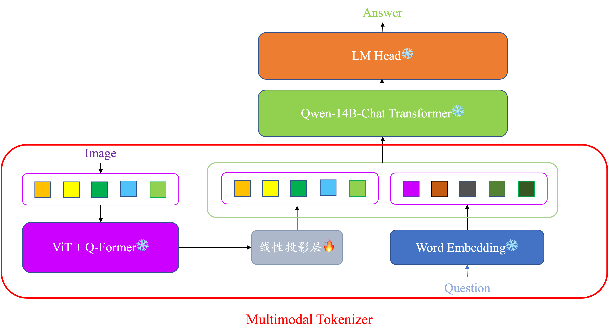
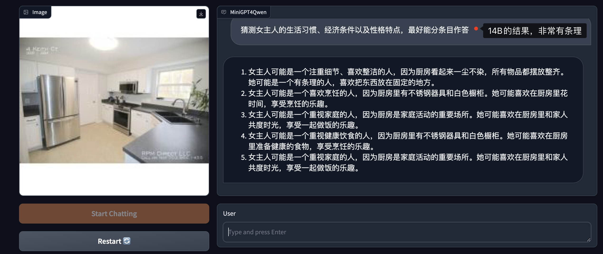
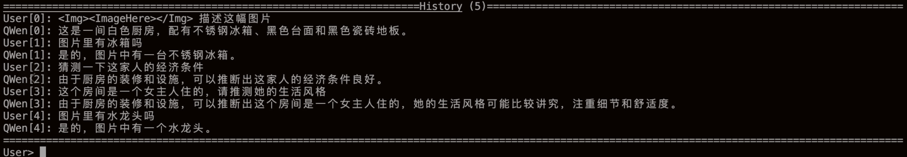
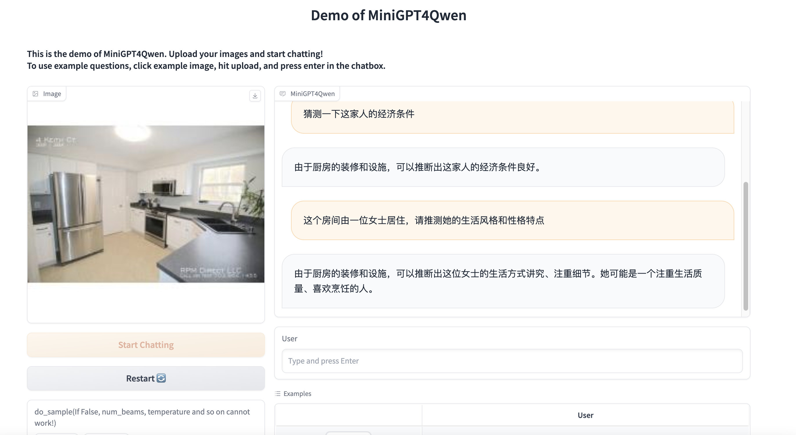
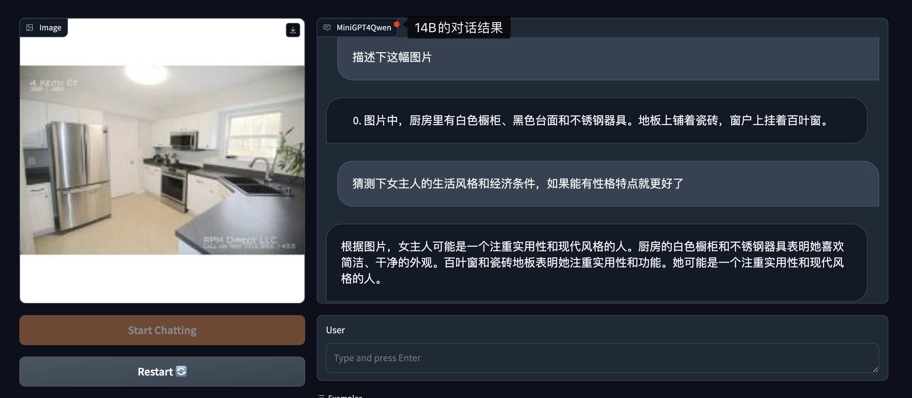

- [Minigpt4Qwen](#minigpt4qwen)
  - [Introduction](#introduction)
  - [附属项目](#附属项目)
  - [所需计算资源](#所需计算资源)
  - [TODO LIST](#todo-list)
  - [Installation](#installation)
  - [Getting Started](#getting-started)
    - [模型下载](#模型下载)
    - [运行test\_model\_chat.py进行初步尝试](#运行test_model_chatpy进行初步尝试)
    - [运行命令行demo](#运行命令行demo)
  - [训练](#训练)
    - [数据准备](#数据准备)
    - [config文件的书写](#config文件的书写)
    - [运行train.py](#运行trainpy)
  - [DeepSpeed](#deepspeed)
    - [DeepSpeed训练](#deepspeed训练)
    - [DeepSpeed推理](#deepspeed推理)
  - [MiniGPT4Qwen-14B的训练](#minigpt4qwen-14b的训练)
    - [2张3090 24GB + DeepSpeed流水线并行](#2张3090-24gb--deepspeed流水线并行)
    - [数据并行 + 流水线并行（DP + PP）](#数据并行--流水线并行dp--pp)
  - [MiniGPT4Qwen-14B的推理](#minigpt4qwen-14b的推理)
    - [权重转换](#权重转换)
    - [release的权重](#release的权重)
    - [CPU推理](#cpu推理)
  - [Minigpt4Qwen对话示例](#minigpt4qwen对话示例)
    - [命令行demo(cli\_demo)](#命令行democli_demo)
    - [webui demo](#webui-demo)
  - [MiniGPT4Qwen14B对话示例](#minigpt4qwen14b对话示例)
  - [Acknowledgement](#acknowledgement)
  - [FAQ](#faq)
    - [复现时比checkpoint中的log的loss大一个数量级的问题](#复现时比checkpoint中的log的loss大一个数量级的问题)
  - [License](#license)


# Minigpt4Qwen

知乎博客：[MiniGPT4Qwen](https://zhuanlan.zhihu.com/p/664612306) 和 [MiniGPT4Qwen-14B](https://zhuanlan.zhihu.com/p/684462477)

**已经支持Qwen-14B模型在2张RTX3090 24GB上的deepspeed流水线并行训练！**


========

======


## Introduction

[MiniGPT4](https://github.com/Vision-CAIR/MiniGPT-4)是最近很火的一个MLLM项目，他证明了对于BLIP2的ViT+Q-former这种已经与语言模态做了对齐预训练的结构，**只需要重训一个Linear层，便可以接入新的LLM**。对于现在这个每个月有一个新的更强的LLM出来的时代，这种构建多模态大模型的方式是十分高效的。

然而，MiniGPT4采用LLaMA、Vicuna作为语言模型，它们的中文支持相对较弱，导致训练出的MLLM对中文支持不好。而现在也有许多开源出来的中文LLM，如：阿里云的Qwen、百川智能的baichuan等。

本项目使用Qwen-Chat作为LLM，用MiniGPT4的对齐方式，更加高效地训练了一个MLLM，名为 `Minigpt4Qwen`。**相比MiniGPT4的两阶段训练（低质量数据对齐 + 高质量数据指令微调），本项目仅仅采用18.8k的高质量指令微调数据，经过单阶段预训练即可达到很好的效果。**

MiniGPT4Qwen14B对语言模型进行了Scale Up，采用Qwen-14B-Chat模型作为底座，以获得更好的对话体验。值得一提的是，为了能在3090上训练14B～15B的模型（不进行量化操作），MiniGPT4Qwen14B选择采用DeepSpeed的流水线并行技术。

## 附属项目

- 干净、灵活的Trainer：https://github.com/Coobiw/MiniGPT4Qwen/tree/master/lavis_trainer_cleaned
    - 知乎：https://zhuanlan.zhihu.com/p/670572461

- grad-checkpoint + amp tutorails：https://github.com/Coobiw/MiniGPT4Qwen/tree/master/amp_and_grad-checkpointing
    - 知乎：https://zhuanlan.zhihu.com/p/671165275?

- deepspeed tutorials：https://github.com/Coobiw/MiniGPT4Qwen/tree/master/deepspeed_tutorials
    - 知乎：https://zhuanlan.zhihu.com/p/673359684

- 支持deepspeed的训练（使用deepspeed runner）
- 支持Qwen-14B模型在2张RTX3090 24GB上的deepspeed流水线并行训练


## 所需计算资源
- MiniGPT4Qwen：>=1张RTX 3090 24GB
- MiniGPT4Qwen14B：2（的整数倍）张RTX 3090 24GB

## TODO LIST

- [x] 支持deepspeed的流水线并行
- [x] 支持Qwen-14B-Chat的训练
- [x] 支持deepspeed
- [x] 开放gradio WebUI demo
- [X] 开放所用数据集和checkpoint
- [X] 开放源代码

## Installation

```bash
conda create -n minigpt4qwen python=3.8
conda activate minigpt4qwen
pip install -e .
```

## Getting Started

### 模型下载

> 请将模型权重下载后都放在 `cache/ckpt`下

```bash
mkdir cache
cd cache
mkdir ckpt
mkdir dataset
```

1.下载BLIP2的相关权重

(a) eva vit-g

[eva_vit_g.pth](https://storage.googleapis.com/sfr-vision-language-research/LAVIS/models/BLIP2/eva_vit_g.pth)

```bash
wget https://storage.googleapis.com/sfr-vision-language-research/LAVIS/models/BLIP2/eva_vit_g.pth
```

(b) bert-base-uncased

[huggingface](https://huggingface.co/bert-base-uncased/tree/main),下载如下的文件即可


(c) blip2_pretrained_flant5xxl

[blip2_pretrained_flant5xxl.pth](https://storage.googleapis.com/sfr-vision-language-research/LAVIS/models/BLIP2/blip2_pretrained_flant5xxl.pth)

```bash
wget https://storage.googleapis.com/sfr-vision-language-research/LAVIS/models/BLIP2/blip2_pretrained_flant5xxl.pth
```

2.下载Qwen-7B-chat/Qwen-14B-Chat的权重

[Qwen-7B-chat huggingface](https://huggingface.co/Qwen/Qwen-7B-Chat)
[Qwen-14B-chat huggingface](https://huggingface.co/Qwen/Qwen-14B-Chat)

3.下载本模型的checkpoint(建议放入 `lavis/output/`)

在本仓库的release里放有checkpoint，可以直接下载

```bash
wget https://github.com/Coobiw/MiniGPT4Qwen/releases/download/instruction-data_and_checkpointv1.0/ckpt.zip
unzip ckpt.zip
```

目录结构：

```bash
├── cache
│   ├── ckpt
│   │   ├── bert-base-uncased
│   │   ├── blip2
│   │   │   ├── blip2_pretrained_flant5xxl.pth
│   │   ├── eva
│   │   │   ├── eva_vit_g.pth
│   │   ├── Qwen7B-chat
```

### 运行test_model_chat.py进行初步尝试

```bash
python test_model_chat.py
```

你可以修改里面的[ckpt_path](https://github.com/Coobiw/MiniGPT4Qwen/blob/8fe80125b91af858b528d74c13c40fbb2fd90ad5/test_model_chat.py#L14)和[img_path](https://github.com/Coobiw/MiniGPT4Qwen/blob/8fe80125b91af858b528d74c13c40fbb2fd90ad5/test_model_chat.py#L16)

### 运行命令行demo

```bash
python cli_demo.py --checkpoint-path xxxxxx
```

运行后需要输入图片路径，输入后进入对话

常见操作：

> :help 查看help
>
> :clear 清空当前命令行
>
> :clh 清空对话历史（但图像输入不会更改）
>
> :his 查看对话历史
>
> :img 查看输入的图像路径

## 训练

### 数据准备

本数据集共含有18.8k个图文对，来自[MMPretrain](https://github.com/open-mmlab/mmpretrain)根据llava和minigpt4处理得到，下载链接：[huggingface](https://huggingface.co/datasets/deepHug/minigpt4_training_for_MMPretrain)

为了支持当前的 `lavis`库的训练框架，我对数据集的annotations进行了重新处理，放到了本仓库的release中，下载链接：[instruction_data](https://github.com/Coobiw/MiniGPT4Qwen/releases/download/instruction-data_and_checkpointv1.0/instruction_data.zip)

```bash
wget https://github.com/Coobiw/MiniGPT4Qwen/releases/download/instruction-data_and_checkpointv1.0/instruction_data.zip
unzip instruction_data
```

最后需要将数据集放入 `./cache/dataset`中，目录结构如下：

```bash
├── cache
│   └── dataset
│       ├── llava
│   │   │   ├── llava_minigpt4qwen_format.json
│   │   │   ├── image
│       ├── minigpt4
│   │   │   ├── image
│   │   │   ├── minigpt4_minigpt4qwen_format.json
```

### config文件的书写

请参考[train.yaml](https://github.com/Coobiw/MiniGPT4Qwen/blob/master/lavis/projects/instruction_tuning/train.yaml)

### 运行train.py

单卡：

```bash
CUDA_VISIBLE_DEVICES=xxx python train.py --cfg-path lavis/projects/instruction_tuning/train.yaml
```

多卡：

```bash
CUDA_VISIBLE_DEVICES=xxx python -m torch.distributed.run --nproc_per_node=8 train.py --cfg-path lavis/projects/instruction_tuning/train.yaml
```


## DeepSpeed

本项目支持了ZERO-{0,1,2,3}的训练、ZERO-{0,1,2}的checkpoint转换、以及ZERO-{0,1,2}的推理（chat和gradio）

### DeepSpeed训练

config文件请参考：[train_zero0_3090x4.yaml](https://github.com/Coobiw/MiniGPT4Qwen/blob/master/lavis/projects/deepspeed/train_zero0_3090x4.yaml)

**运行命令**

```bash
CUDA_VISIBLE_DEVICES=0,1,2,3 python -m torch.distributed.run --nproc_per_node=4 train.py --cfg-path lavis/projects/deepspeed/train_zero0_3090x4.yaml --use-deepspeed
```


### DeepSpeed推理

上述训练过程会调用deepspeed的`save_checkpoint`方法，得到类似下图的目录：


可以运行以下命令得到模型的`.pth`文件：

```bash
python deepspeed2pth.py --ckpt_dir lavis/output/deepspeed/lr1e-4_4x3090/20231220150/deepspeed_ckpt/epoch_9
```

之后会在该目录中生成一个`model.pth`文件

接着就可以用该`.pth`文件去使用`cli_demo.py`或`webui_demo.py`进行聊天啦～

## MiniGPT4Qwen-14B的训练
本项目使用3090显卡，每张24GB的显存，14GB的模型，不计算其他任何开销，在16bits（fp16/bf16）的情况下，也至少需要14 $\times$ 2 = 28 GB的显存，并不能符合现有的硬件条件

**方案：流水线并行（模型按layer粒度进行划分，一些layer在GPU0，一些layer在GPU1，是串行进行计算的，也是一种模型并行的方案）**

### 2张3090 24GB + DeepSpeed流水线并行
p.s.：如今暂时只支持并行在2张显卡上

训练命令：
```
# num_stages代表并行的卡数，如今只支持2
python -m torch.distributed.run --nproc_per_node=2 train_pipeline.py --cfg-path lavis/projects/pp_qwen14b/train_pp.yaml --num-stages 2
```

### 数据并行 + 流水线并行（DP + PP）
4卡3090，DP=2，PP=2，所以`nproc_per_node`=2 $\times$ 2=4
训练命令：
```
# num_stages代表并行的卡数，如今只支持2
python -m torch.distributed.run --nproc_per_node=4 train_pipeline.py --cfg-path lavis/projects/pp_qwen14b/train_pp.yaml --num-stages 2
```

## MiniGPT4Qwen-14B的推理

### 权重转换
将`llm_proj`层的参数提取出来，转换成pth
```
python pipe_proj2pth.py --ckpt_dir xxx
```

### release的权重
[14B模型checkpoint](https://github.com/Coobiw/MiniGPT4Qwen/releases/download/instruction-data_and_checkpointv1.0/pp_14b_ckpt-logs.zip)

### CPU推理
由于3090无法放下14B模型，所以这里采用CPU进行推理

命令行demo：
```
python cli_demo.py --model-type qwen14b_chat -c xxx/model.pth --cpu-only
```

gradio webui demo:
```
python webui_demo.py --model-type qwen14b_chat -c xxx/model.pth --cpu-only
```


## Minigpt4Qwen对话示例

### 命令行demo(cli_demo)

输入图片:

 

对话内容展示：（通过 `:his`)



### webui demo


====


**开启do_sample和beam search**


## MiniGPT4Qwen14B对话示例

===


## Acknowledgement

- [Lavis](https://github.com/salesforce/LAVIS) 本仓库是基于lavis进行构建的
- [QwenLM](https://github.com/QwenLM/Qwen) 本仓库的语言模型采用Qwen-7B-Chat
- [MiniGPT4](https://github.com/Vision-CAIR/MiniGPT-4) 本仓库的主要思想来自MiniGPT4
- [MMPretrain](https://github.com/open-mmlab/mmpretrain) 提供所需的双语指令微调数据集
- [DeepSpeed](https://github.com/microsoft/DeepSpeed) 👍
- [DeepSpeedExamples](https://github.com/microsoft/DeepSpeedExamples) 👍👍

## FAQ

### 复现时比checkpoint中的log的loss大一个数量级的问题

对应issue：https://github.com/Coobiw/MiniGPT4Qwen/issues/5

在https://github.com/Coobiw/MiniGPT4Qwen/commit/4ad76d15c79cec9b08e8f0f0da69732d0924a9db 这个commit中，我修改了log时loss显示的问题。

简单来说就是我放出来的log里的loss是除过梯度积累的iteration数的（就是`accum_grad_iters`，在yaml文件里是设置成16或者32），所以你看到的会差一个数量级，如果你使用的是这个commit之后的代码跑出这个结果是正常的

## License

- 本仓库的许多代码是基于[Lavis](https://github.com/salesforce/LAVIS) 的，其采用 [BSD 3-Clause License](https://github.com/Vision-CAIR/MiniGPT-4/blob/main/LICENSE_Lavis.md).
- 本仓库采用Qwen-7B-Chat，支持商用和科研、开发用途，其License为[LICENSE](https://github.com/QwenLM/Qwen/blob/main/LICENSE)