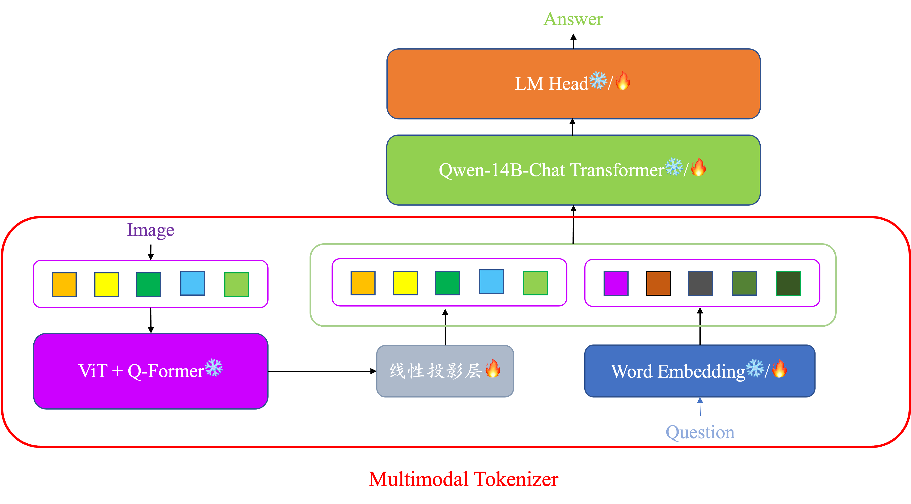
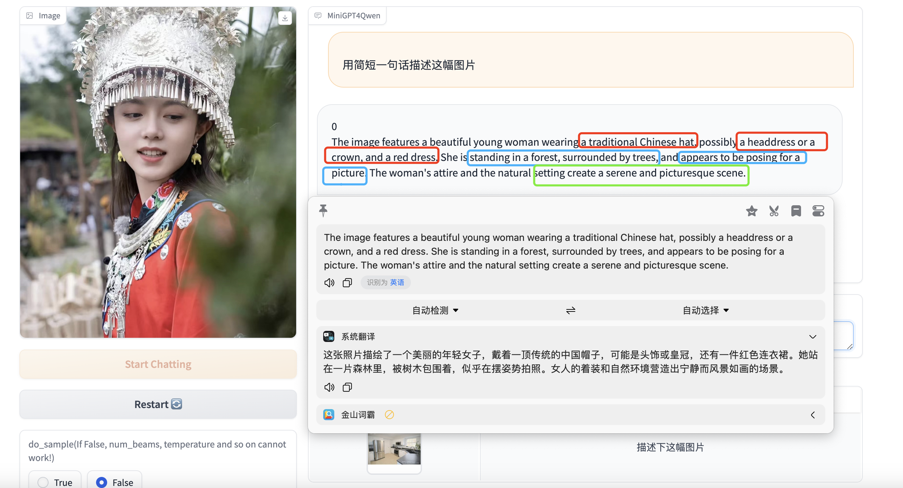
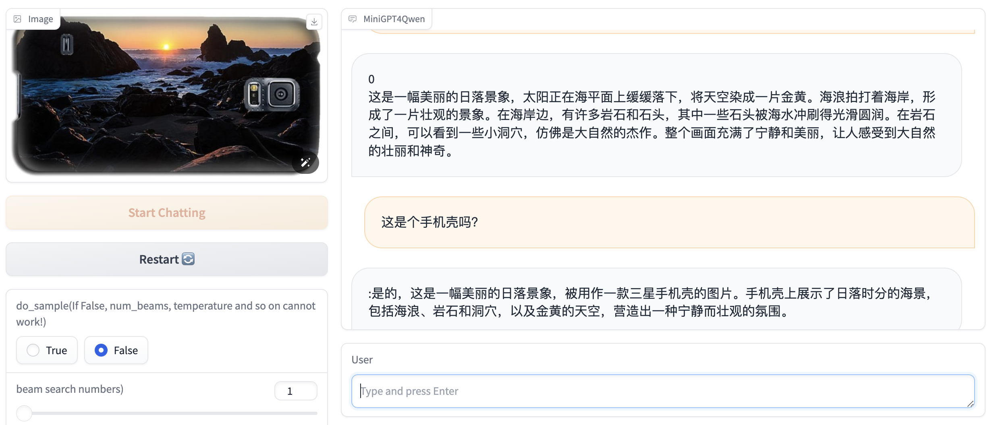
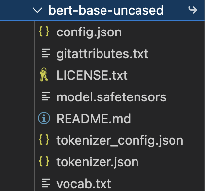
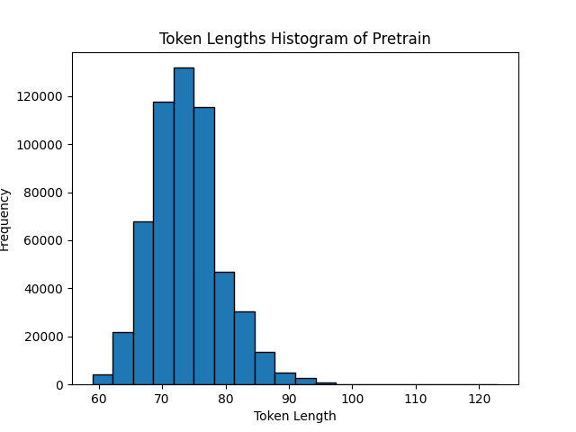
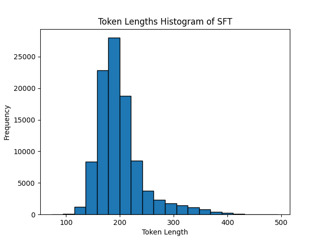

- [MPP-Qwen14B](#mpp-qwen14b)
  - [Introduction](#introduction)
  - [附属项目](#附属项目)
  - [所需计算资源](#所需计算资源)
  - [TODO LIST](#todo-list)
  - [Installation](#installation)
  - [Getting Started](#getting-started)
    - [模型下载](#模型下载)
  - [训练](#训练)
    - [数据准备](#数据准备)
    - [数据tokens数目分析](#数据tokens数目分析)
    - [运行train\_pipeline.py进行流水线并行训练](#运行train_pipelinepy进行流水线并行训练)
  - [deepspeed权重转换为pth文件](#deepspeed权重转换为pth文件)
    - [预训练阶段](#预训练阶段)
    - [sft阶段](#sft阶段)
  - [推理](#推理)
    - [运行命令行demo](#运行命令行demo)
    - [运行gradio webui demo](#运行gradio-webui-demo)
  - [MPP-Qwen14B对话示例](#mpp-qwen14b对话示例)
  - [Acknowledgement](#acknowledgement)
  - [License](#license)

似乎被爱可可老师转发了🥹，感谢大家关注！

MiniGPT4Qwen相关可以跳转到：[MiniGPT4Qwen_README.md](https://github.com/Coobiw/MiniGPT4Qwen/blob/master/MiniGPT4Qwen_README.md)
# MPP-Qwen14B
知乎博客：[https://zhuanlan.zhihu.com/p/687106694](https://zhuanlan.zhihu.com/p/687106694)

**已支持MPP-Qwen-14B模型在2张RTX4090 24GB上预训练和6张RTX4090 24GB上sft的deepspeed流水线并行训练！**


========

======


## Introduction
去年11月发布的[LLaVA1.5](https://github.com/haotian-liu/LLaVA)，用可以接受的数据量（558K Pretrain + 665K SFT），以Vicuna-v1.5-13B为基座，得到了非常好的性能。后续被学术界和工业界广泛follow。

在读过其在github上的README后发现，24GB的消费级别显卡（RTX3090、RTX4090等）仅可以完成以Vicuna-v1.5-7B为底座的训练，而且Open出的是LoRA的配置。

**为了不让贫穷限制想象力**，接着MiniGPT4Qwen-14B的deepspeed流水线并行框架，推出MPP-Qwen14B（Multimodal Pipeline Parallel-Qwen14B），**全程在RTX4090 24GB上完成只训练linear层的Pretrain阶段和LLM全参数训练的SFT阶段。**

## 附属项目
- 知乎博客：[MiniGPT4Qwen-14B](https://zhuanlan.zhihu.com/p/684462477)
- 知乎博客：[MiniGPT4Qwen](https://zhuanlan.zhihu.com/p/664612306)
- 干净、灵活的Trainer：https://github.com/Coobiw/MiniGPT4Qwen/tree/master/lavis_trainer_cleaned
    - 知乎：https://zhuanlan.zhihu.com/p/670572461

- grad-checkpoint + amp tutorails：https://github.com/Coobiw/MiniGPT4Qwen/tree/master/amp_and_grad-checkpointing
    - 知乎：https://zhuanlan.zhihu.com/p/671165275?

- deepspeed tutorials：https://github.com/Coobiw/MiniGPT4Qwen/tree/master/deepspeed_tutorials
    - 知乎：https://zhuanlan.zhihu.com/p/673359684


## 所需计算资源
- MPP-Qwen14B Pretrain：2张RTX 4090 24GB
- MPP-Qwen14B SFT：6张RTX 4090 24GB

## TODO LIST
- [ ] 支持model parallelism的推理（参考[llama2-accessory](https://github.com/Alpha-VLLM/LLaMA2-Accessory)）
- [ ] 开源sft权重（huggingface或百度网盘）
- [x] 开源pretrain权重
- [x] 开源处理好的pretrain和sft的数据集json文件
- [x] 开源pretrain和sft代码和config
- [x] 支持deepspeed的流水线并行

## Installation

```bash
conda create -n minigpt4qwen python=3.8
conda activate minigpt4qwen
pip install -e .
```

## Getting Started

### 模型下载

> 请将模型权重下载后都放在 `cache/ckpt`下

```bash
mkdir cache
cd cache
mkdir ckpt
mkdir dataset
```

1.下载BLIP2的相关权重

(a) eva vit-g

[eva_vit_g.pth](https://storage.googleapis.com/sfr-vision-language-research/LAVIS/models/BLIP2/eva_vit_g.pth)

```bash
wget https://storage.googleapis.com/sfr-vision-language-research/LAVIS/models/BLIP2/eva_vit_g.pth
```

(b) bert-base-uncased

[huggingface](https://huggingface.co/bert-base-uncased/tree/main),下载如下的文件即可



(c) blip2_pretrained_flant5xxl

[blip2_pretrained_flant5xxl.pth](https://storage.googleapis.com/sfr-vision-language-research/LAVIS/models/BLIP2/blip2_pretrained_flant5xxl.pth)

```bash
wget https://storage.googleapis.com/sfr-vision-language-research/LAVIS/models/BLIP2/blip2_pretrained_flant5xxl.pth
```

2.下载Qwen-14B-Chat的权重

[Qwen-14B-chat huggingface](https://huggingface.co/Qwen/Qwen-14B-Chat)

3.获得pretrain后的checkpoint（optional，如果你想直接在这上面做sft的话）

(建议放入 `lavis/output/pp_14b/pretrain`)

在本仓库的release里放有checkpoint，可以直接下载

```bash
wget https://github.com/Coobiw/MiniGPT4Qwen/releases/download/MPP-Qwen14B_ckpt-and-data/ckpt-and-data.zip
unzip ckpt-and-data.zip
```

目录结构：

```bash
├── cache
│   ├── ckpt
│   │   ├── bert-base-uncased
│   │   ├── blip2
│   │   │   ├── blip2_pretrained_flant5xxl.pth
│   │   ├── eva
│   │   │   ├── eva_vit_g.pth
│   │   ├── Qwen-14B-chat
```


## 训练

### 数据准备

MPP-Qwen14B使用了LLaVA的Pretrain和指令微调的数据集，所以整体数据获取流程与LLaVA仓库说明的大体一致。

预训练数据：[558K subset of the LAION-CC-SBU dataset with BLIP captions](https://huggingface.co/datasets/liuhaotian/LLaVA-Pretrain)，去该huggingface链接下载`images.zip`和`blip_laion_cc_sbu_558k.json`

指令微调数据：下载coco的train2017里的图片：
```bash
wget http://images.cocodataset.org/zips/train2017.zip
unzip train2017.zip
```

MPP-Qwen14B format的标注json文件：在本仓库的release中([https://github.com/Coobiw/MiniGPT4Qwen/releases/tag/MPP-Qwen14B_ckpt-and-data](https://github.com/Coobiw/MiniGPT4Qwen/releases/tag/MPP-Qwen14B_ckpt-and-data)):
```bash
wget https://github.com/Coobiw/MiniGPT4Qwen/releases/download/MPP-Qwen14B_ckpt-and-data/ckpt-and-data.zip
unzip ckpt-and-data.zip
```

然后按照下面的目录结构组织文件

最后需要将数据集放入 `./cache/dataset`中，目录结构如下：

```bash
├── cache
│   └── dataset
│       ├── llava_pretrain
│   │   │   ├── blip_laion_cc_sbu_558k
│   │   │   |   ├── images
│   │   │   |   ├── llava_pretrain_minigpt4qwen_format.json
│       ├── llava_instuct
│   │   │   ├── coco
│   │   │   |   ├── train2017
│   │   │   ├── llava_instruction_100k.json
```

### 数据tokens数目分析
```bash
python tokenize_analysis.py
```


======


根据此，会在train的配置文件中，pretrain和sft的`max_txt_len`分别设置为256和512

### 运行train_pipeline.py进行流水线并行训练

Pretrain：

```bash
python -m torch.distributed.run --nproc_per_node=2 train_pipeline.py --cfg-path lavis/projects/pp_qwen14b/pretrain_pp.yaml --num-stages 2
```

SFT：

```bash
python -m torch.distributed.run --nproc_per_node=6 train_pipeline.py --cfg-path lavis/projects/pp_qwen14b/sft_100k_pp.yaml --num-stages 6
```

## deepspeed权重转换为pth文件

### 预训练阶段

（仅转换linear projection层）

```bash
python pipe_proj2pth.py --ckpt-dir lavis/output/pp_14b/pretrain/global_stepxxx
```

转换后，模型文件会存储在`ckpt_dir`底下，名为`model.pth`

### sft阶段

（需要转换projection层和所有LLM的参数）

```bash
python pipemodel2pth.py --ckpt-dir lavis/output/pp_14b/sft/global_stepxxx
```

转换后，模型文件会存储在`ckpt_dir`底下，名为`unfreeze_llm_model.pth`

## 推理

### 运行命令行demo

```bash
python cli_demo.py -c xxxxxx --model-type qwen14b_chat --cpu-only # 如果显存足够(>30GB)可以不要--cpu-only
```

运行后需要输入图片路径，输入后进入对话

常见操作：

> :help 查看help
>
> :clear 清空当前命令行
>
> :clh 清空对话历史（但图像输入不会更改）
>
> :his 查看对话历史
>
> :img 查看输入的图像路径

### 运行gradio webui demo
```bash
python webui_demo.py -c xxxxxx --model-type qwen14b_chat --cpu-only # 如果显存足够(>30GB)可以不要--cpu-only
```

## MPP-Qwen14B对话示例
========

======


## Acknowledgement

- [Lavis](https://github.com/salesforce/LAVIS) 本仓库是基于lavis进行构建的，且使用了其中BLIP2的ViT和Q-former
- [QwenLM](https://github.com/QwenLM/Qwen) 本仓库的语言模型采用Qwen-14B-Chat
- [DeepSpeed](https://github.com/microsoft/DeepSpeed) 👍
- [DeepSpeedExamples](https://github.com/microsoft/DeepSpeedExamples) 👍👍
- [LLaVA](https://github.com/haotian-liu/LLaVA) 参照其训练范式，使用了其预训练和指令微调数据

## License

- 本仓库的许多代码是基于[Lavis](https://github.com/salesforce/LAVIS) 的，其采用 [BSD 3-Clause License](https://github.com/Vision-CAIR/MiniGPT-4/blob/main/LICENSE_Lavis.md).
- 本仓库采用Qwen-7B-Chat，支持商用和科研、开发用途，其License为[LICENSE](https://github.com/QwenLM/Qwen/blob/main/LICENSE)
