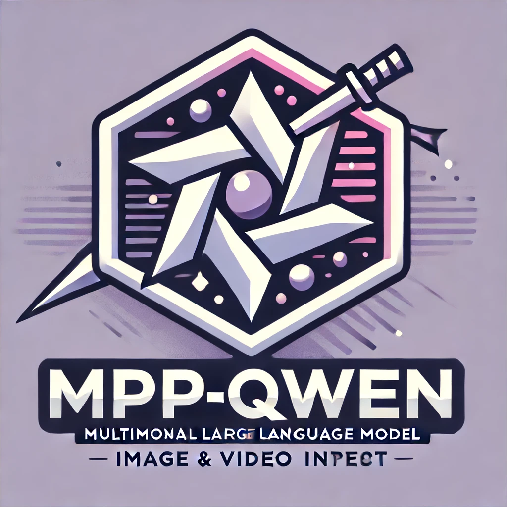
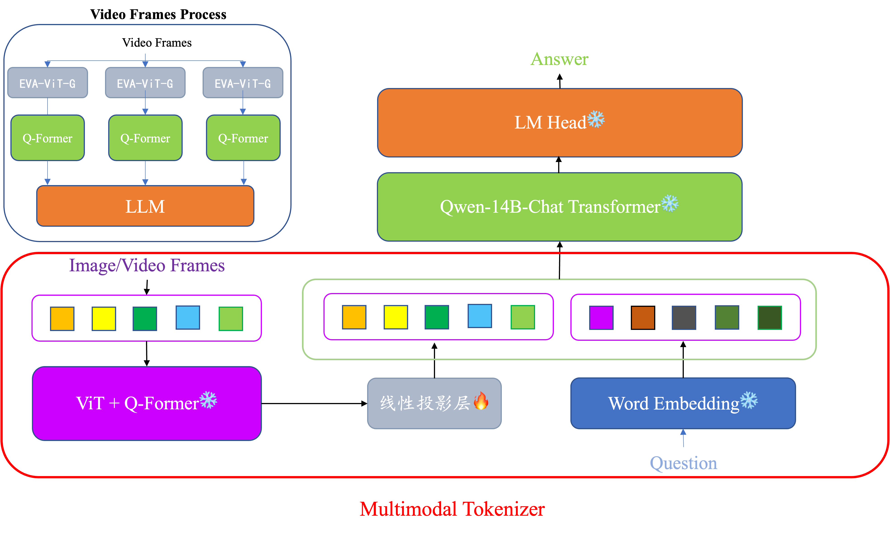
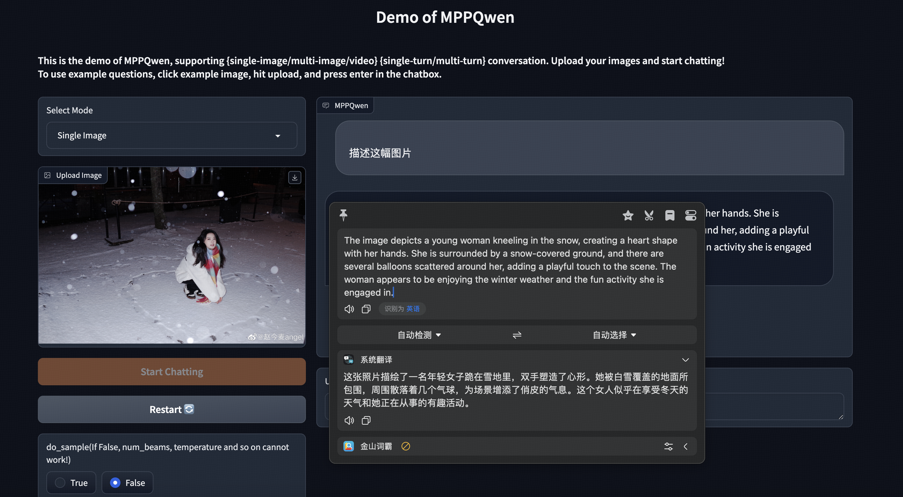
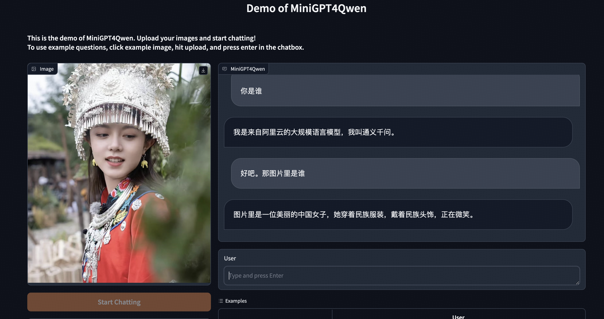
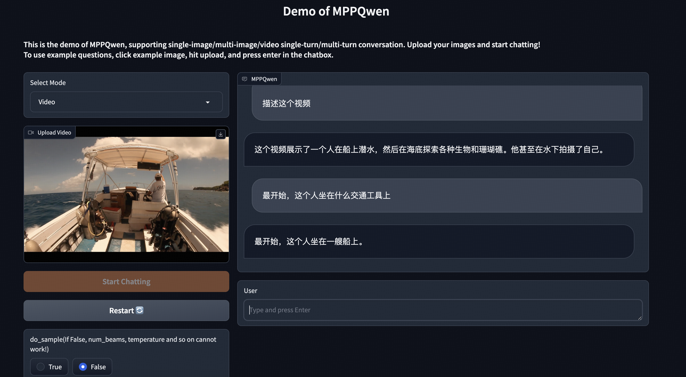
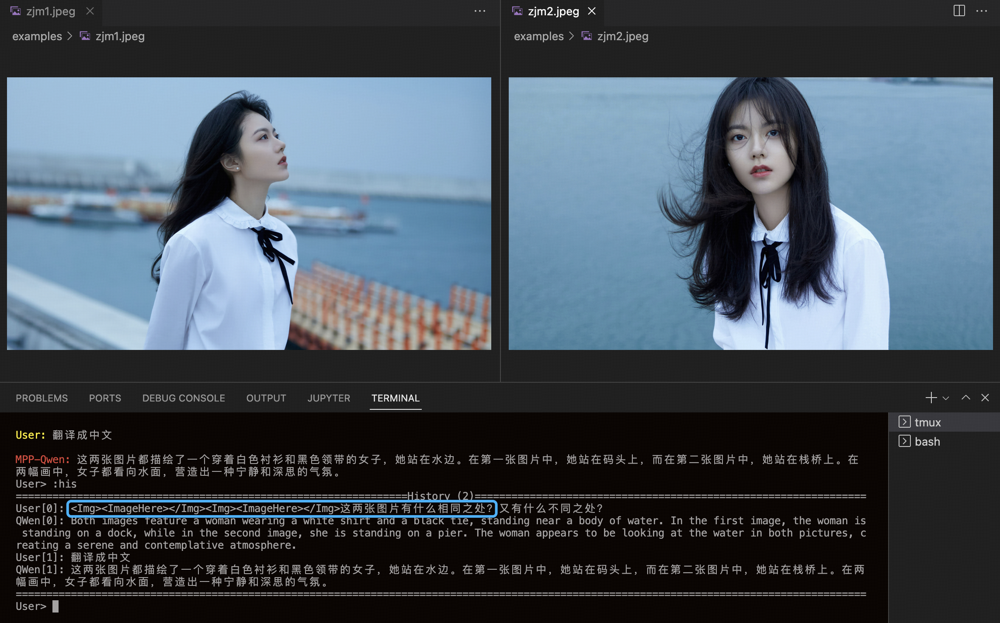
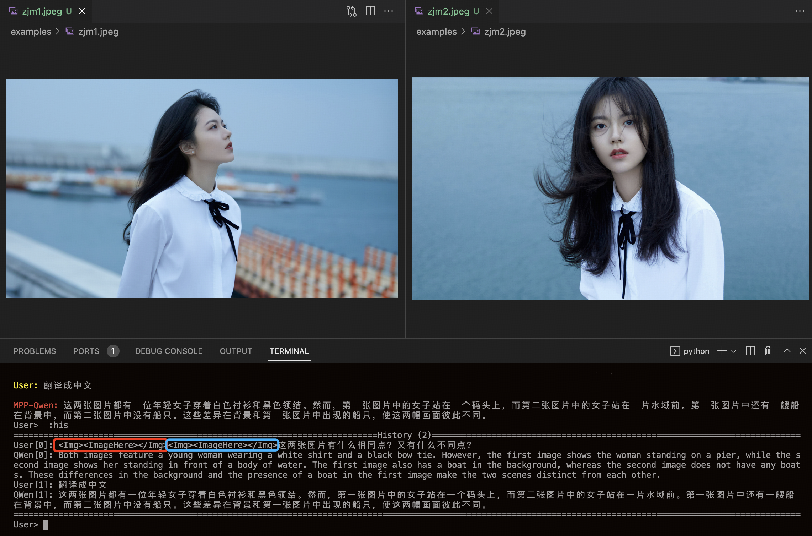
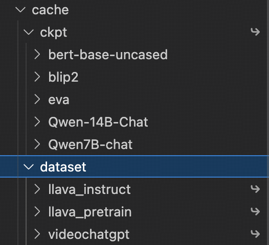
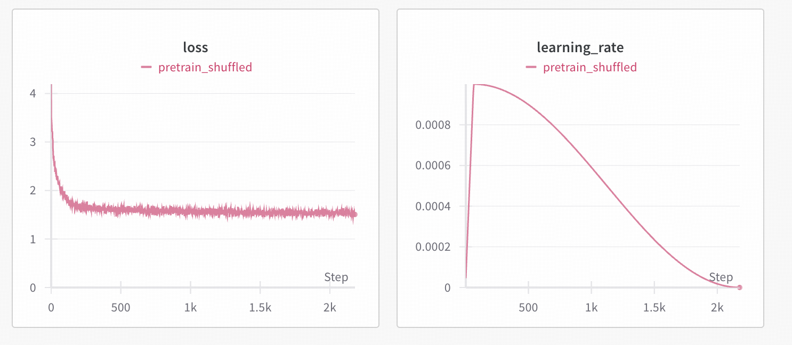
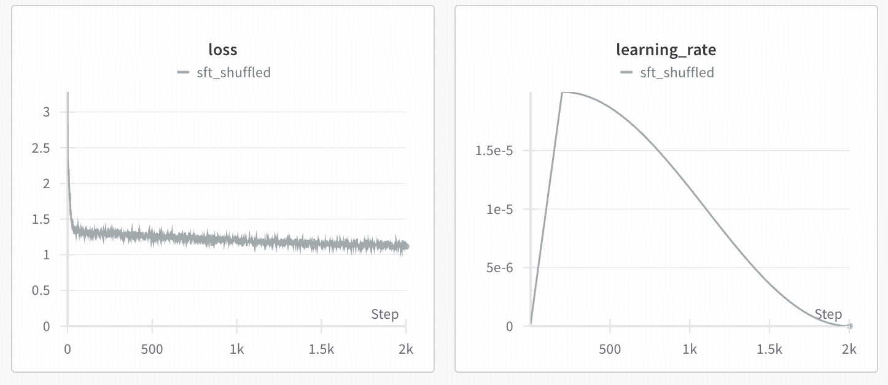

<div align="center">
    
</div>

- [MPP-Qwen-Next: Multimodal Pipeline Parallel based on QwenLM](#mpp-qwen-next-multimodal-pipeline-parallel-based-on-qwenlm)
  - [News](#news)
  - [Framework](#framework)
  - [Features](#features)
    - [图像-单轮问答](#图像-单轮问答)
    - [图像-多轮对话](#图像-多轮对话)
    - [视频-对话](#视频-对话)
    - [多图-对话（未经过多图sft，视频sft后涌现该能力）](#多图-对话未经过多图sft视频sft后涌现该能力)
  - [TODO LIST](#todo-list)
  - [Installation](#installation)
  - [Weight\&Data Preparation](#weightdata-preparation)
  - [推理](#推理)
  - [流水线并行训练(PP+DP)](#流水线并行训练ppdp)
  - [二阶段训练loss曲线参考](#二阶段训练loss曲线参考)
  - [Custom Data Format(如果你想continue training)](#custom-data-format如果你想continue-training)
  - [Acknowledgement](#acknowledgement)
  - [License](#license)
  - [Star History](#star-history)


# MPP-Qwen-Next: Multimodal Pipeline Parallel based on QwenLM

https://github.com/Coobiw/MiniGPT4Qwen/assets/48615375/963416dd-fd97-4680-b7ac-fa4a14beaaae

<video controls>
  <source src="https://github.com/Coobiw/MiniGPT4Qwen/assets/48615375/963416dd-fd97-4680-b7ac-fa4a14beaaae" type="video/mp4">
  Your browser does not support the video tag.
</video>

https://github.com/Coobiw/MiniGPT4Qwen/assets/48615375/0e7c33f6-33d3-478a-ab0e-ecc116aeec78

<video controls>
  <source src="https://github.com/Coobiw/MiniGPT4Qwen/assets/48615375/0e7c33f6-33d3-478a-ab0e-ecc116aeec78" type="video/mp4">
  Your browser does not support the video tag.
</video>

## News
- [2024/6] 🔥 开源MPP-Qwen-Next的sft权重(15GB) [modelscope链接](https://www.modelscope.cn/models/Coobiw/MPP-Qwen-Next) [百度网盘链接](https://pan.baidu.com/s/15rfwuCfM_sdViWQJv1mZmg?pwd=baka)
- [2024/6] 🔥 **MPP-Qwen-Next**: 加入llava的多轮对话sft数据以及videochatgpt的100k sft数据，**支持图像多轮对话，视频对话，并涌现出多图对话能力** [知乎博客](https://zhuanlan.zhihu.com/p/703597348)
- [2024/5] 🔥 代码支持多轮对话sft、视频sft、多图sft
- [2024/4] 🔥 支持多卡推理，修正chat template以获得更好的对话效果 [知乎博客](https://zhuanlan.zhihu.com/p/698549757)
- [2024/3] 🔥 **MPPQwen-14B**: Extend MiniGPT4Qwen-14B to MPP-Qwen14B(Multimodal Pipeline Parallel). 数据和训练范式参照LLaVA（pretrain + sft)，指令微调时打开LLM。**全部训练过程在6张RTX4090上完成** [README&Tutorial](https://github.com/Coobiw/MiniGPT4Qwen/blob/master/MPPQwen14B_README.md)； [知乎博客](https://zhuanlan.zhihu.com/p/687106694)
- [2024/2] 🔥 **MiniGPT4Qwen-14B**: Scaling Up MiniGPT4Qwen to 14B. **使用DeepSpeed Pipeline Parallel让全过程仅使用2张4090显卡** [README&Tutorial](https://github.com/Coobiw/MiniGPT4Qwen/blob/master/MiniGPT4Qwen_README.md)； [知乎博客](https://zhuanlan.zhihu.com/p/684462477)
- [2023/10] 🔥 **MiniGPT4Qwen**：采用18.8k的高质量双语指令微调数据，得到**单阶段训练的个人版双语MLLM** [README&Tutorial](https://github.com/Coobiw/MiniGPT4Qwen/blob/master/MiniGPT4Qwen_README.md)； [知乎博客](https://zhuanlan.zhihu.com/p/664612306)

## Framework



## Features

### 图像-单轮问答


### 图像-多轮对话


### 视频-对话


### 多图-对话（未经过多图sft，视频sft后涌现该能力）
---
无视频sft的MPP-14B模型多图对话（看似回答，实际啥都没说）：


---
视频sft后的MPPQwen-8B模型（具备比较不同图像的能力）：



## TODO LIST
- [ ] 加入huggingface-transformers实现，并push到huggingface
- [x] 开源sft权重（modelscope & 百度网盘）
- [x] 支持单图推理、多图推理、视频推理
- [x] 支持model parallelism的推理（使用了transformers的`device_map="auto"`）
- [x] 开源pretrain权重
- [x] 开源处理好的pretrain和sft的数据集json文件
- [x] 支持多轮对话、多图sft、视频sft
- [x] 支持deepspeed的流水线并行

## Installation

```bash
conda create -n minigpt4qwen python=3.8 && conda activate minigpt4qwen
pip install -e .
```

## Weight&Data Preparation
请放在`cache`目录中，结构如下


模型权重请参照：[WEIGHT.md](https://github.com/Coobiw/MiniGPT4Qwen/blob/master/WEIGHT.md)

训练数据请参照：[DATA.md](https://github.com/Coobiw/MiniGPT4Qwen/blob/master/DATA.md)

## 推理
请先按照[WEIGHT.md](https://github.com/Coobiw/MiniGPT4Qwen/blob/master/WEIGHT.md)配置好权重

并在以下链接中二选一，下载sft后的模型权重（15GB）：
- [modelscope链接](https://www.modelscope.cn/models/Coobiw/MPP-Qwen-Next)
- [百度网盘链接](https://pan.baidu.com/s/15rfwuCfM_sdViWQJv1mZmg?pwd=baka)
### 运行命令行demo

**Single-GPU Inference**

```bash
python cli_demo.py --model-type qwen7b_chat -c lavis/output/pp_7b_video/sft_video/global_step2005/unfreeze_llm_model.pth
```


**MultiGPU(llm使用`device_map="auto"加载`，可以多卡加载LLM部分模型：**

```bash
python cli_demo.py --model-type qwen7b_chat -c lavis/output/pp_7b_video/sft_video/global_step2005/unfreeze_llm_model.pth --llm_device_map "auto"
```


**CPU（速度慢）:**

```bash
python cli_demo.py--model-type qwen7b_chat -c lavis/output/pp_7b_video/sft_video/global_step2005/unfreeze_llm_model.pth --cpu-only # 如果显存足够(>=20GB)可以不要--cpu-only
```

运行后需要输入图片路径，可以输入多张图片，用`:f`结束图片路径输入后进入对话

常见操作：

> :help 查看help
>
> :clear 清空当前命令行
>
> :clh 清空对话历史（但图像输入不会更改）
>
> :his 查看对话历史
>
> :img 查看输入的图像路径

### 运行gradio webui demo

**Single-GPU Inference**

```bash
python webui_demo.py --model-type qwen7b_chat -c lavis/output/pp_7b_video/sft_video/global_step2005/unfreeze_llm_model.pth
```


**MultiGPU(llm使用`device_map="auto"加载`**

```bash
python webui_demo.py --model-type qwen7b_chat -c lavis/output/pp_7b_video/sft_video/global_step2005/unfreeze_llm_model.pth --llm_device_map "auto"
```


**CPU：**

```bash
python webui_demo.py --model-type qwen7b_chat -c lavis/output/pp_7b_video/sft_video/global_step2005/unfreeze_llm_model.pth --cpu-only # 如果显存足够(>=20GB)可以不要--cpu-only
```

## 流水线并行训练(PP+DP)
下面为8卡3090运行指令:

### Pretrain
> nproc_per_node: 8
> dp: 4
> pp: 2
> nproc_per_node = pp * dp

```bash
python -m torch.distributed.run --nproc_per_node=8 train_pipeline.py --cfg-path lavis/projects/pp_qwen7b_video/pretrain.yaml --num-stages 2
```

### SFT
> nproc_per_node: 8
> dp: 1
> pp: 8
> nproc_per_node = pp * dp

```bash
python -m torch.distributed.run --nproc_per_node=8 train_pipeline.py --cfg-path lavis/projects/pp_qwen7b_video/sft.yaml --num-stages 8
```

### pipeline parallel的权重转换为pth文件

#### 预训练阶段:

（仅转换linear projection层）

```bash
python pipe_proj2pth.py --ckpt-dir lavis/output/pp_7b_video/pretrain/global_step2181
```

转换后，模型文件会存储在`ckpt_dir`底下，名为`model.pth`

#### sft阶段

（需要转换projection层和所有LLM的参数）

```bash
python pipemodel2pth.py --ckpt-dir lavis/output/pp_7b_video/sft_video/global_step2005
```

转换后，模型文件会存储在`ckpt_dir`底下，名为`unfreeze_llm_model.pth`

## 二阶段训练loss曲线参考
---

pretrain：


---
sft:


## Custom Data Format(如果你想continue training)
处理函数可以参考: [https://github.com/Coobiw/MiniGPT4Qwen/releases/download/MPP-Qwen-Next_ckpt-and-data/ckpt-and-data.zip](https://github.com/Coobiw/MiniGPT4Qwen/releases/download/MPP-Qwen-Next_ckpt-and-data/ckpt-and-data.zip)中，llava_instuct和videochatgpt目录里的`analysis.py`脚本

***P.S.: 如果路径经常出错，可以把所有路径都改成绝对路径（包括dataset configs）***
### 图像指令微调数据格式
单轮(instruction和output为`str`)：
```json
[
    {
        "image": "000000215677.jpg",
        "instruction": "<ImageHere></Img> {question}",
        "output": "{answer}"
    },
]
```

多轮(instruction和output为等长的`list`)：
```json
{
        "image": "000000479443.jpg",
        "instruction": [
            "<ImageHere></Img> {question1}",
            "{question2}",
            "..."
        ],
        "output": [
            "{answer1}",
            "{answer2}",
            "..."
        ]
    },
```

### 视频指令微调数据格式
```json
[
    {
        "video": "v_k_ZXmr8pmrs.mkv",
        "instruction": "<ImageHere></Img> {question}",
        "output": "{answer}"
    }
]
```

## Acknowledgement

- [Lavis](https://github.com/salesforce/LAVIS) 本仓库是基于lavis进行构建的，且使用了其中BLIP2的ViT和Q-former
- [QwenLM](https://github.com/QwenLM/Qwen) 本仓库的语言模型采用Qwen7B-Chat
- [DeepSpeed](https://github.com/microsoft/DeepSpeed) 👍
- [DeepSpeedExamples](https://github.com/microsoft/DeepSpeedExamples) 👍👍
- [LLaVA](https://github.com/haotian-liu/LLaVA) 参照其训练范式，使用了其预训练和指令微调数据
- [VideoChatGPT](https://github.com/mbzuai-oryx/Video-ChatGPT) 使用其视频sft的100k数据
- [Video-LLaVA](https://github.com/PKU-YuanGroup/Video-LLaVA) 提供videochatgpt视频数据的百度网盘下载链接

## License

- 本仓库的许多代码是基于[Lavis](https://github.com/salesforce/LAVIS) 的，其采用 [BSD 3-Clause License](https://github.com/Vision-CAIR/MiniGPT-4/blob/main/LICENSE_Lavis.md).
- 本仓库采用Qwen-7B-Chat，支持商用和科研、开发用途，其License为[LICENSE](https://github.com/QwenLM/Qwen/blob/main/LICENSE)

## Star History

[](https://star-history.com/#Coobiw/MPP-LLaVA&Date)
