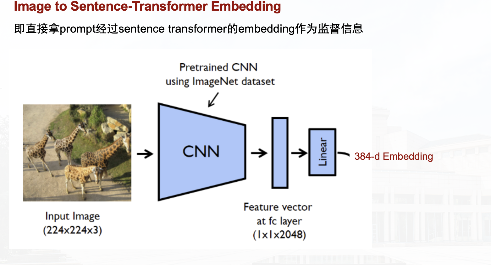
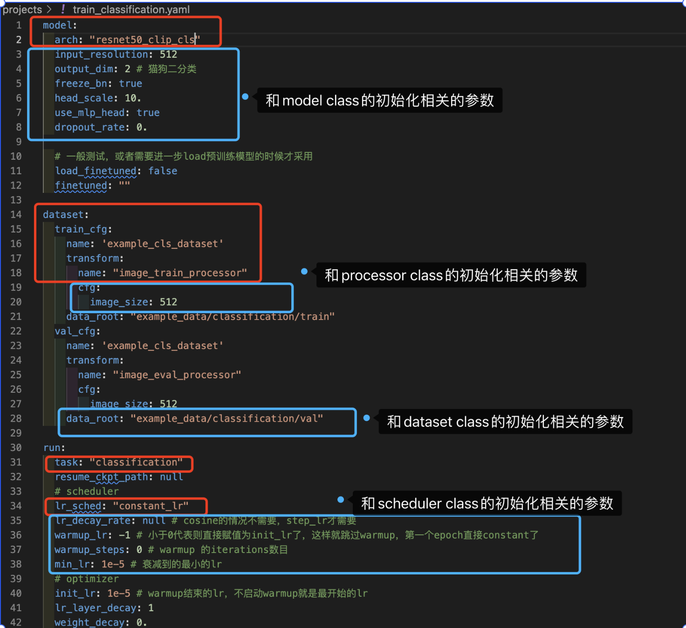

# 基于Lavis实现的干净、灵活的Trainer

知乎：https://zhuanlan.zhihu.com/p/670572461

## Introduction

该项目主要是重构lavis之后搭建的，lavis（https://github.com/salesforce/LAVIS ）是多模态领域很火的一个开源仓库，像BLIP2、InstructBLIP、MiniGPT4等许多多模态大模型都是基于lavis进行进一步开发的。在仔细阅读其源码后，我非常喜欢它的代码框架，所以我针对其Trainer进行重构，**可以更加灵活地适配或迁移到用户的任务、模型、数据集。**


## 实现的功能

- Registry机制：为model、dataset、processor（预处理的transform）、lr_scheduler、task（现在进行的task，如：分类、分割、image2prompt等）构建注册表
- 完整、灵活的配置文件：一个配置文件对应一次完整的运行（训练），有多而不冗余的参数可供设置
- 去冗余性：
    - 对于上述的注册表中的每个组件，都提供有基类，减少代码重复
    - 去除一些重复、冗余的功能
- 可扩展性/灵活性：自顶向下满足了
    - 任务可扩展（类似于OpenMMLab基于MMEngine和MMCV支持了那么多视觉、多模态任务）：对于所有任务均可支持，本项目支持了图像分类（以猫狗分类为例）、Image2Prompt（为了适配本菜鸡第一次kaggle比赛（https://www.kaggle.com/competitions/stable-diffusion-image-to-prompts )，最终获得银牌，虽菜但难忘就实现了它进来，简易化pipeline如下图）
    - 模型可扩展
    - 数据集可扩展性（包含预处理的可扩展性）
    - scheduler的可扩展性




## 支持新功能的QuickTutorial

### 定义你的数据集

在`datasets`目录下，继承`BaseDataset`类，实现你的dataset，如果需要自定义`collator`，请在这里完成

例如 如下代码完成了一个新的分类数据集定义，其目录结构见`example_data/classification`：

```python
from common.registry import registry
from .base_dataset import BaseDataset

from PIL import Image
from pathlib import Path
import os

import torch

@registry.register_dataset('example_cls_dataset')
class ExampleClsDataset(BaseDataset):
    def __init__(self, transform, data_root):
        super().__init__(transform=transform)
        self.data_root = Path(data_root)
        self.cls_dir = sorted(list(os.listdir(self.data_root)))

        self.data = []
        self.labels = []

        self.idx2cls,self.cls2idx = {}, {}
        for i,cls in enumerate(self.cls_dir):
            self.idx2cls[i] = cls
            self.cls2idx[cls] = i
            imgs = [str(self.data_root/cls/img) for img in os.listdir(self.data_root/cls) if self.is_img(img)]
            self.data.extend(imgs)
            self.labels.extend([i]*len(imgs))

        assert len(self.data) == len(self.labels)


    def __len__(self):
        return len(self.data)

    def __getitem__(self, index):
        image_path = self.data[index]
        label = self.labels[index]

        image = Image.open(image_path).convert("RGB")

        return self.transform(image), torch.tensor(label,dtype=torch.long)

    @staticmethod
    def is_img(img_path):
        return Path(img_path).suffix.lower() in ['.jpg', '.jpeg', '.png']

    def collator(self,batch):
        images, labels = zip(*batch)
        images = torch.stack(images)
        labels = torch.stack(labels)

        return {"images": images, "labels": labels}
```


### 定义你的模型

在`models`目录下，继承`BaseModel`类进行实现，可以参考本库给出的`resnet_clip`

注意：请为你的模型实现`train_step`和`val_step`两个方法，会在`task.train_step`和`task.val_step`时调用


### 定义新的task

在`tasks`目录下，继承`BaseTask`类进行实现，可以参考本库给出的`ClassificationTask`任务

注：一般来说，只需要针对任务和任务对应的metric修改`val_step`即可

## 配置文件的大致参数说明

